<p align="center">
  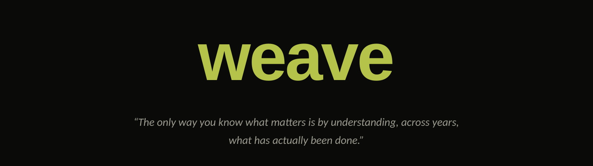
</p>

weave fine-tunes a coding agent on the history of the company it works for (Discord, Jira and GitHub), so it already knows the things nobody wrote down.

Built for the Databricks track. The whole pipeline runs on Databricks, and Lakebase is the source of truth for every stage.

---

## The problem

Ask an agent to make a button blue. It's been opened in `packages/ui/button/`, it sees three files, and it decides this is a one-line change.

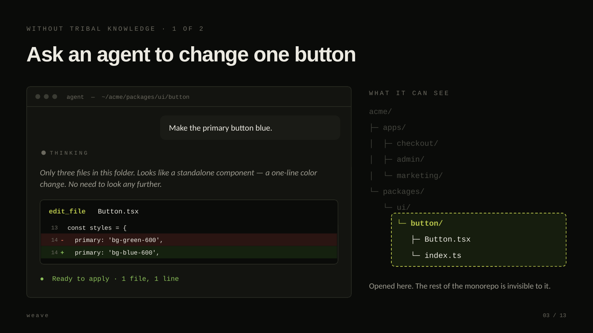

It's wrong. That component is shared across the monorepo, and one line of CSS changes every app that imports it.

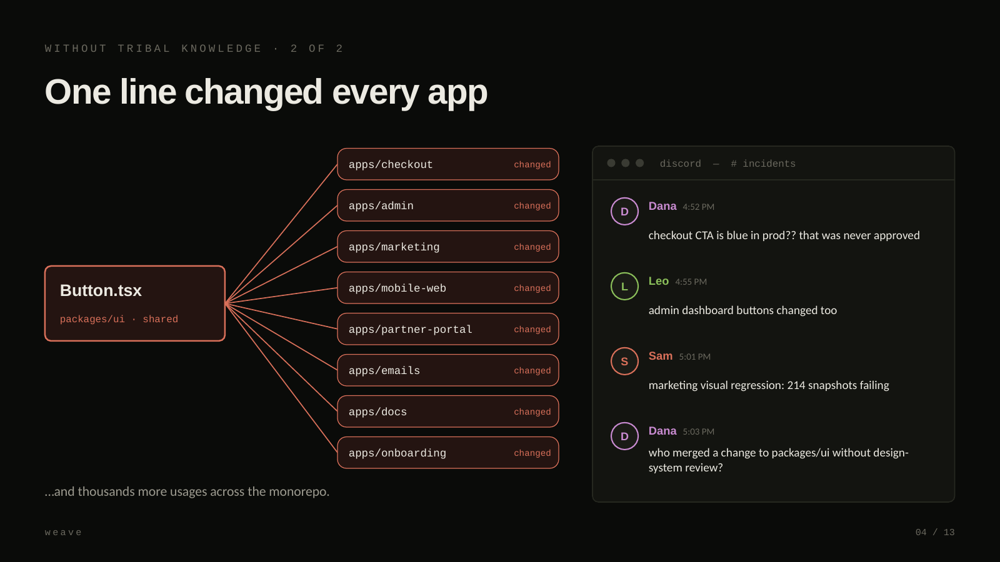

The usual fix is a vector database over your docs and tickets. But the agent only searches when it thinks it's lost, and this task looked trivial. Even when it does search, a decade of unlabelled history comes back as noise.

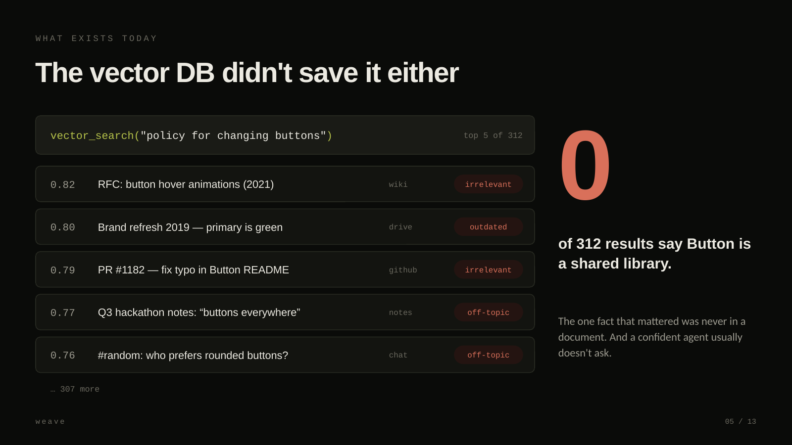

What the agent needed was never in a document. It was in a Discord thread, where someone said *"careful, Button lives in packages/ui"*. That is tribal knowledge, and we train it into the weights instead of hoping retrieval finds it.

## How it works

**1. Land the raw streams (bronze).** Discord messages, Jira changelogs, GitHub commits and PRs, stored as-is.

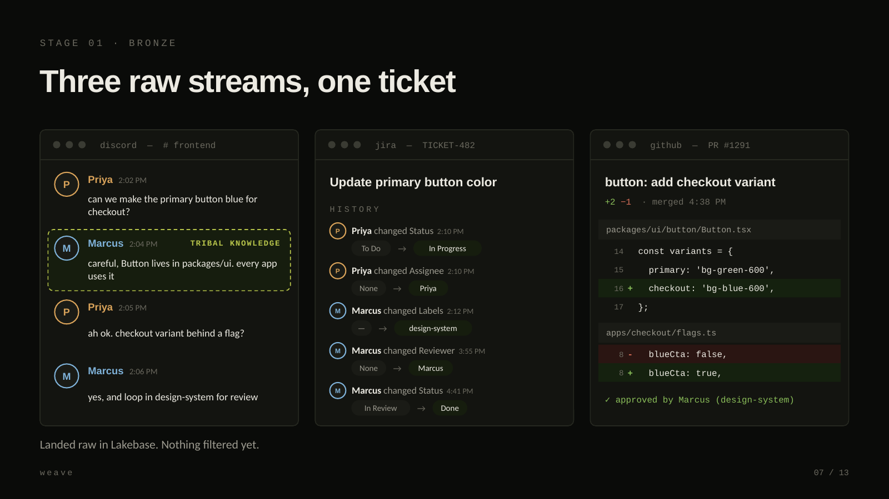

**2. Clean and link (silver).** Malformed JSON, missing fields, broken timestamps and bot messages go to `silver.quarantine`; nothing is deleted. Commits, tickets and threads get linked to each other.

**3. Find the tasks (gold).** A model proposes where each task started and ended, and it has to cite its evidence. Plain code then checks that every cited row actually falls inside the window, and drops the window if one doesn't. The model proposes; the code decides.

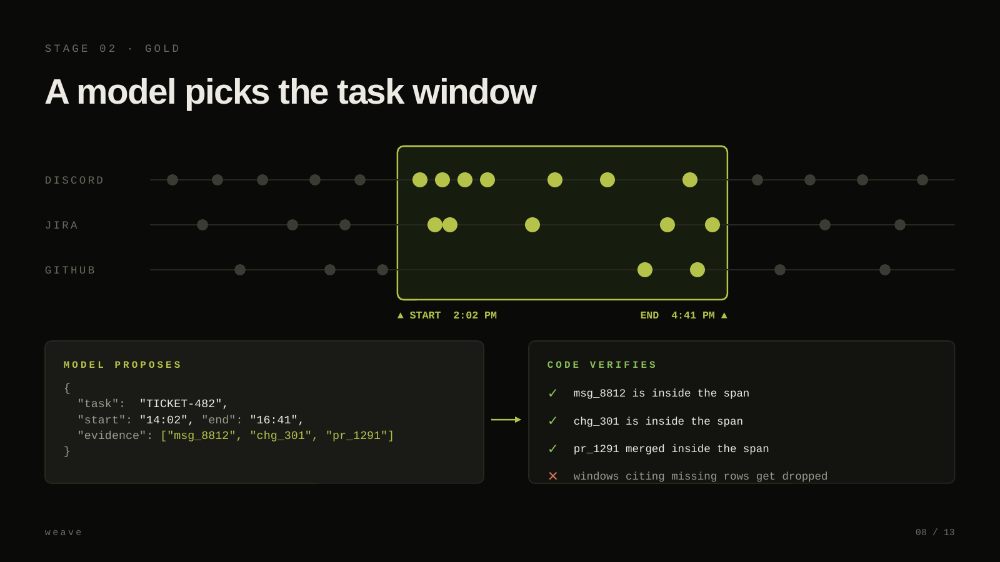

**4. Replay them (platinum).** Each window becomes a workspace (`TASK.md`, `CHAT.md`, `EVENTS.md`, `COMMITS.md`, `REPO/`). A supervisor model then works the task inside our harness, using the same ten tools the harness ships. Every tool call is recorded.

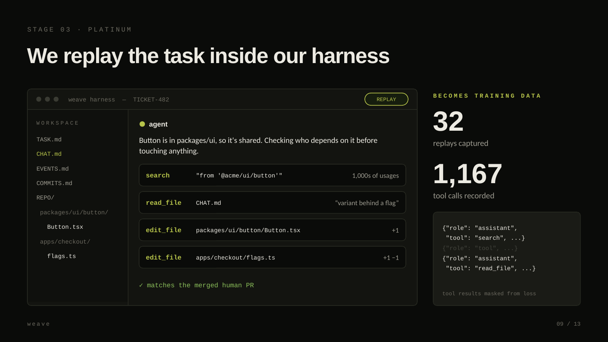

**5. Train.** LoRA on the replay transcripts. Loss applies to assistant turns only; tool results are masked so the model doesn't learn to invent them.

Same ticket, after training:

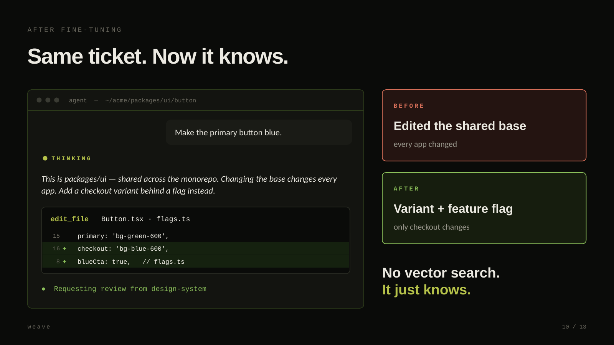

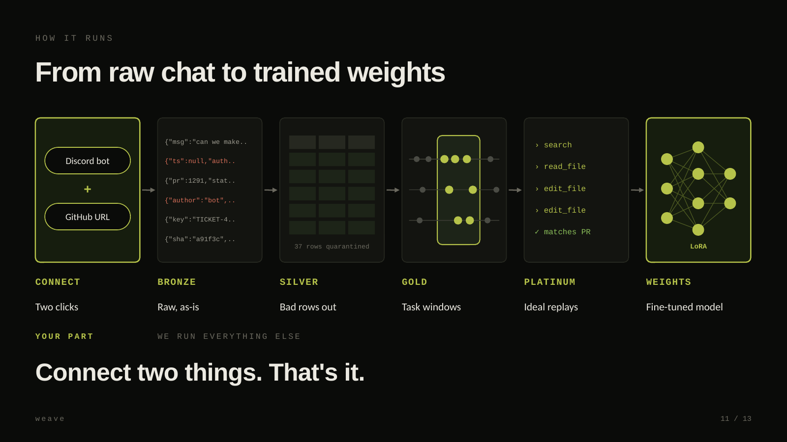

## On Databricks

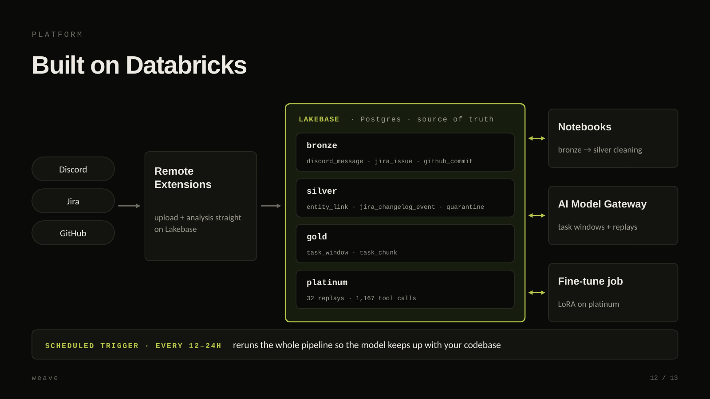

| | |
|---|---|
| **Lakebase** | Postgres; every stage from bronze to platinum lives here |
| **Notebooks** | bronze → silver cleaning, window slicing, dataset build |
| **AI Model Gateway** | every model call: window proposals and replays |
| **Remote Extensions** | uploading raw data and running analysis directly against Lakebase |
| **Scheduled triggers** | rerun the pipeline every 12–24h so the model keeps up |
| **Databricks Apps** | deploys the platform (`platform/databricks.yml`) |

## Repo layout

```
scripts/notebooks/     the pipeline
  03_silver_to_gold.py     window detection + gold slice
  04_gold_to_platinum.py   threaded replay, 10 tools
  05_build_dataset.py      platinum -> chat+tools jsonl
  06_finetune.py           dataset validation + job submission
  07_train_lora.py         LoRA trainer for a Databricks GPU job
  run_03_live.py           runs stage 03 against the live database
  detach.py                keeps long jobs alive after the shell dies

platform/              FastAPI: marketing page, dashboard, OpenAI-compatible API
  app.py  store.py  core.py  ingest.py  databricks.yml

chat-electron/         the harness (Electron + Next)
bot/                   Discord archiver
```

## The harness

The harness is the desktop app the model is trained inside. It has the same ten tools used during replay:

`list_dir` `read_file` `write_file` `edit_file` `search` `run_command` `make_dir` `environment` `diff` `list_changes`

It also has a realpath-enforced workspace jail, undo snapshots that survive a `kill -9`, and a transcript kept in true event order. It can point at OpenRouter or at a weave server's `/v1/chat/completions`.

## Numbers from our run

```
32 task windows          810 chunk rows
32 replays               1,167 tool calls
18 training convos       131,481 tokens
37 rows quarantined      696 orphan tool results caught before training
119 tests passing
```

## Status

The pipeline runs end to end, from raw data to a validated training set. The LoRA trainer is written but a full run hasn't finished yet; on a 16 GB machine it stalls after loading, so the next step is running it as a Databricks GPU job. All numbers above come from our own synthetic workspace, not from a real multi-year corpus.

## Business model

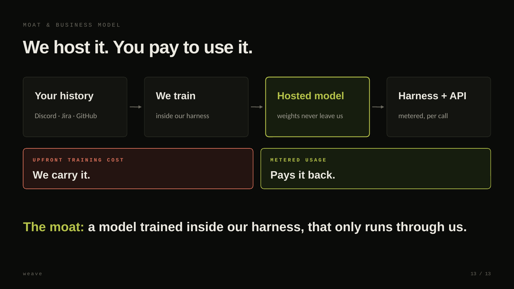

We carry the training cost, host the model, and never ship the weights. Companies pay per call through the API and the harness.